<p align="center">
  
</p>

<p align="center">
  <a href="https://github.com/prasodium/shokuba/actions/workflows/ci.yml"></a>
  <a href="LICENSE"></a>
  
  
  
</p>

<h3 align="center">Watch, control, and verify a living team of AI software engineers.</h3>

<p align="center">
  <b>Shokuba</b> (職場, <i>"workplace"</i>) is a local-first desktop app that runs real AI coding agents<br>
  as employees in a living isometric-voxel office — and makes them prove their work.
</p>

---

## What is this?

Most multi-agent tools are a wall of terminals. Shokuba is an **engineering control center** with a **living office on top**.

- Every AI agent is an **employee** with a role, a desk, skills and a real terminal.
- The office is **not decoration**. If an agent is running a test, its employee is at the QA station. If it hands work to a reviewer, it _walks over and hands it_. The office is a live view of real runtime state.
- Work isn't "done" because an agent said so. It's done when there's **evidence**: the diff, the test results, an **independent reviewer's** findings, and a verification report.
- **You stay the owner.** Approve, pause, redirect, reassign — or let it run, within the limits you set.
- **Local-first.** SQLite, Git and your own CLIs. No cloud backend required.

## Status: early development

Shokuba is being built in the open, in small, tested increments. Here is exactly where it stands — nothing below is marketing.

<p align="center">
  
</p>
<p align="center"><sub>Six <b>demo (simulated)</b> agents in an office laid out like a real one: a pantry with a tea and coffee counter and a snack shelf, a glass manager cabin (the manager sits in it, and their team sits together in the open area), your own cabin where finished work will land, the lab with the QA bench and the mission board, a glass meeting room and the reading room. Each bubble says what the event stream reports, and is marked <code>demo</code> here, because nothing in this screenshot is a real AI. Drag to move the view, scroll to zoom, or follow one employee. The shared places stand idle for now, except that an agent running tests walks to the QA bench (see below).</sub></p>

|                         |                                                                                                                                                                                                                                                                                                                                                                                                                                                                                                                                                                                                                                                                                                                                                                                                                                                                                                                                                                                                                                                                                                                                                                                                                                                                                                                                                                                                                                                                                                                                                                                                                                                                                                      |
| ----------------------- | ---------------------------------------------------------------------------------------------------------------------------------------------------------------------------------------------------------------------------------------------------------------------------------------------------------------------------------------------------------------------------------------------------------------------------------------------------------------------------------------------------------------------------------------------------------------------------------------------------------------------------------------------------------------------------------------------------------------------------------------------------------------------------------------------------------------------------------------------------------------------------------------------------------------------------------------------------------------------------------------------------------------------------------------------------------------------------------------------------------------------------------------------------------------------------------------------------------------------------------------------------------------------------------------------------------------------------------------------------------------------------------------------------------------------------------------------------------------------------------------------------------------------------------------------------------------------------------------------------------------------------------------------------------------------------------------------------- |
| ✅ **Working today**    | Employees you can create, edit and start · a real terminal for each (xterm.js + PTY) · **Claude Code** launched in it · an isometric voxel office laid out like a real one (pantry, glass manager cabin, open desks, meeting room), with pan, zoom and follow, whose bubbles follow the event stream, and where an agent running tests walks to the QA bench and back, and **work visibly changes hands** (task cards, your inbox, checks lighting the bench, a reviewer sitting at a reading desk), and idle employees **take tea and snack breaks** (simulated, labelled, and switchable), **chat and meet** (an empty simulated bubble, never words), and a real message shows its real subject over the employees it is between, and **each employee's character is yours to edit** (skin, hair, style, what they wear), **roles are editable** (Shokuba's own can be reset, yours can be added), **departments** seat their people together under a coloured plate, and **the office is yours to dress** (name, floors, walls, windows, plants, what the places are called) · a simulated demo agent (no AI account needed) · **missions with a task graph** · **messages between agents with loop protection** · **a circuit breaker for runaway agents** · **teams with a manager who talks to you and drafts missions for the team** · **each task in its own Git branch, with a diff to review, merged into a mission branch you merge yourself** · **checks you define, run on every submission** · **an independent reviewer that reads the work and advises you** · **an evidence pack you can save for any task** · event log, redaction, hardened IPC · CI on macOS, Linux and Windows |
| 🔬 **Not yet verified** | Claude Code, _interactively_, reporting through its hooks and calling the mission tools. Both hook delivery and the MCP handshake are verified against the real Claude Code 2.1.276 in headless mode, and the real interface runs in the terminal, but the interactive end-to-end check is pending (see the [roadmap](docs/ROADMAP.md))                                                                                                                                                                                                                                                                                                                                                                                                                                                                                                                                                                                                                                                                                                                                                                                                                                                                                                                                                                                                                                                                                                                                                                                                                                                                                                                                                              |
| 🚧 **Building next**    | GitHub: turning an issue into a plan, work, verification and a pull request                                                                                                                                                                                                                                                                                                                                                                                                                                                                                                                                                                                                                                                                                                                                                                                                                                                                                                                                                                                                                                                                                                                                                                                                                                                                                                                                                                                                                                                                                                                                                                                                                          |
| 🗺️ **Planned**          | Codex / Gemini CLI / custom providers · GitHub issue → verified PR · replay                                                                                                                                                                                                                                                                                                                                                                                                                                                                                                                                                                                                                                                                                                                                                                                                                                                                                                                                                                                                                                                                                                                                                                                                                                                                                                                                                                                                                                                                                                                                                                                                                          |

<p align="center">
  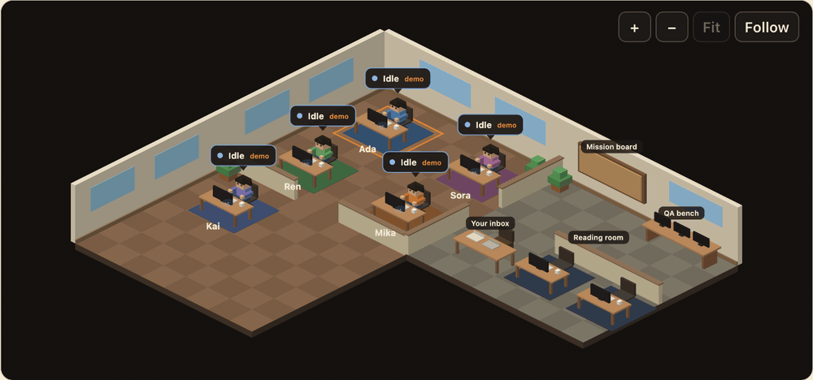
</p>
<p align="center"><sub>Two <b>demo</b> agents running tests (an animation, played at the pace it happened). When an agent has been running what looks like a test command for a few seconds, its employee walks to the QA bench and back. It is deduced from the command, so the bubble says <b>inferred</b> and <i>at the QA bench</i>. Nobody walks for a flicker, nobody walks if your system asks for reduced motion, and nothing else moves without a real reason.</sub></p>

<p align="center">
  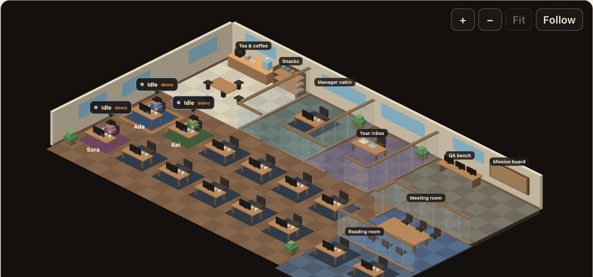
</p>
<p align="center"><sub>Work changing hands, with <b>demo</b> agents (an animation, with the quiet stretches cut out). A task is handed over, submitted, checked by Shokuba (the bench's screens go amber, then green), reviewed by a second employee who sits at a reading desk while the review is in progress, and accepted by you. Every card, flight and lit screen is a picture of something recorded (a card in your inbox means the task is submitted; a green card is not a verdict, since only you accept a task), and with reduced motion turned on nothing flies or walks, though the places still show where the work is.</sub></p>

<p align="center">
  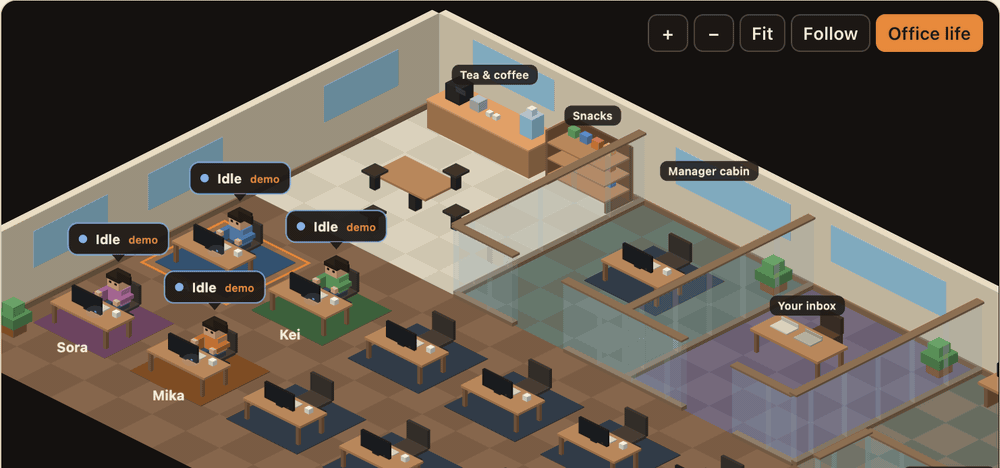
</p>
<p align="center"><sub>Real messages, with <b>demo</b> agents (an animation). When employees message each other (here a demo team answering each other until Shokuba stops the exchange), a note with the <b>real subject</b> of the conversation appears over each of them for a few seconds: <i>to Kei</i> over the sender, <i>from Ada</i> over the recipient. It is a picture of a recorded message, so it is not marked simulated, and nobody leaves their desk for it. When the subject is not known the note leaves it out instead of making one up.</sub></p>

<p align="center">
  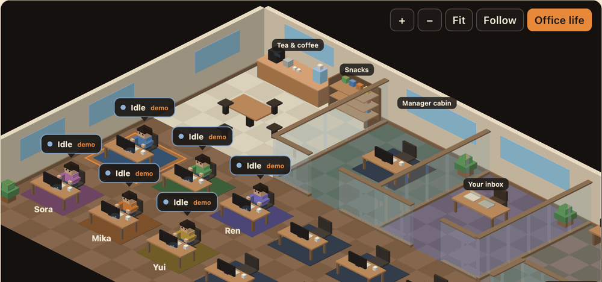
</p>
<p align="center"><sub>Office life, with <b>demo</b> agents (an animation, sped up a little). An employee whose agent has been idle for a while walks to the tea counter or the snack shelf and back. <b>None of this is real</b>, and the bubble says so: <b>simulated</b>. It only ever happens while an agent is idle or waiting (the moment it starts working, its employee heads back), it is never recorded, nothing is ever sent to an agent because of it, and the <b>Office life</b> button (top right of the office) turns it off. It is calm on purpose: at most a third of the team is away at once, and nobody goes again for a couple of minutes.</sub></p>

<p align="center">
  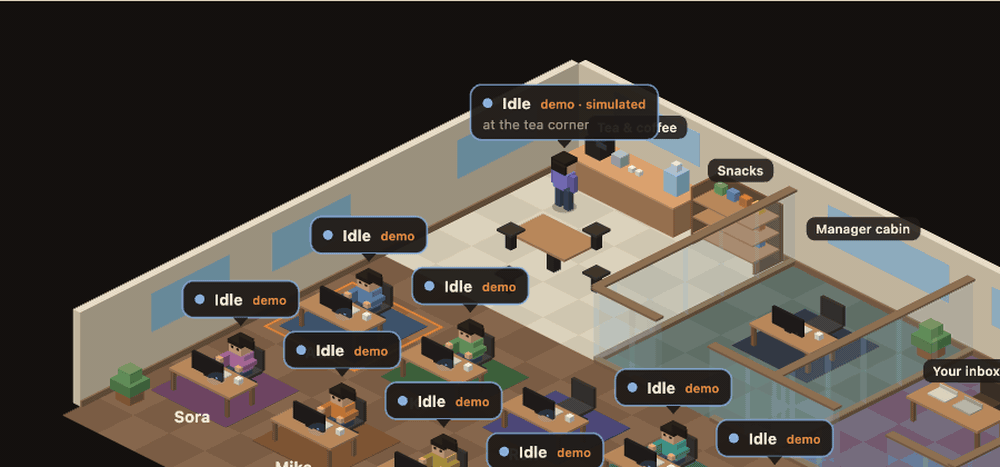
</p>
<p align="center"><sub>Office life, later in the day, with <b>demo</b> agents (an animation, sped up a little). Idle employees also go <b>together</b>: two or three chat at the pantry table, and in a bigger team three to five meet in the meeting room. When they are all there, they take turns showing an <b>empty bubble marked simulated</b>: three dots and nothing else, because nothing here is said, and nothing in it could be mistaken for a real message. (A real message's subject, shown above, always comes first.) It stays calm: a chat or meeting takes at most half the team, only people who are idle and free are asked along, and everyone goes back the moment their agent starts working.</sub></p>

<p align="center">
  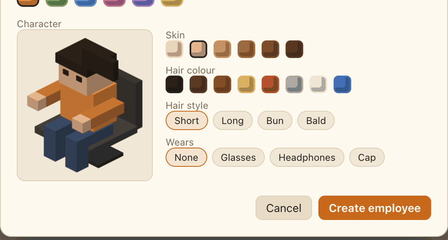
</p>
<p align="center"><sub>The character editor (an animation). Skin tone, hair colour, hair style and what someone wears are each chosen from a fixed set, and the preview is drawn with the same geometry as the office, so it shows exactly what the office will. Employees hired before it look as they always did until edited.</sub></p>

<p align="center">
  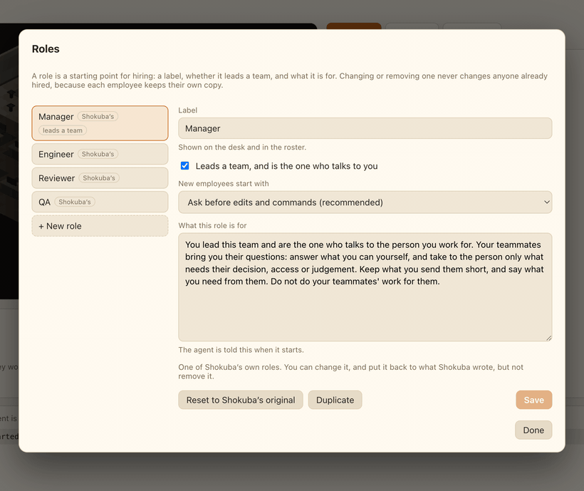
</p>
<p align="center"><sub>The role editor (an animation). Roles are starting points for hiring: a label, whether it leads a team, what it is for, and the permissions a new employee starts with. Shokuba's four can be edited and reset to the original but not removed; add, duplicate and remove your own. Editing or removing a role never changes anyone already hired, because each employee keeps their own copy.</sub></p>

<p align="center">
  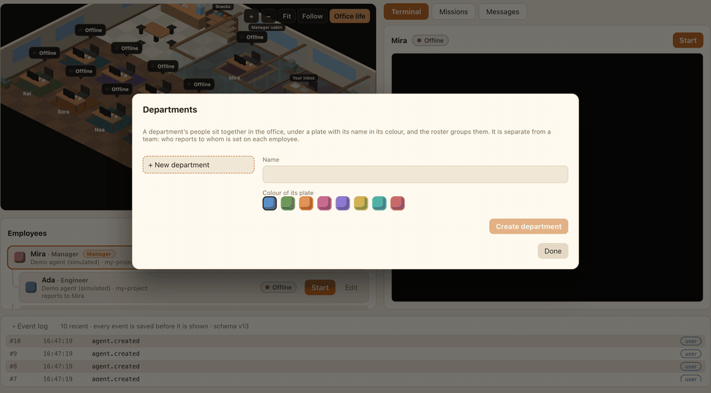
</p>
<p align="center"><sub>Departments (an animation, with <b>demo</b> agents). A department is a name and a colour; its people sit together, under a plate in its colour, and the roster groups them. It is separate from a team: who reports to whom is untouched. Removing a department removes nobody, and with no departments the office is seated exactly as before.</sub></p>

<p align="center">
  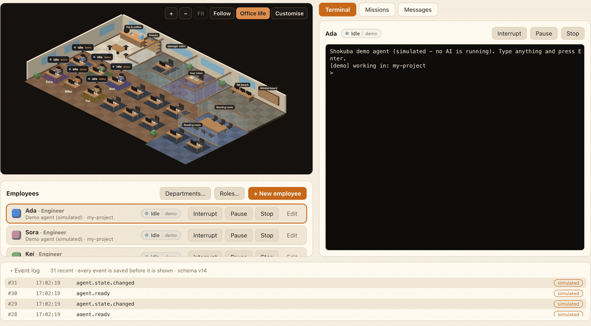
</p>
<p align="center"><sub>Dressing the office (an animation, with <b>demo</b> agents). Name it, choose a theme or a floor for each kind of room, the walls, windows and plants, and rename the shared places. The floor plan itself stays as it is, so everyone can always reach every desk and every place, and with the defaults the office looks exactly as it always did.</sub></p>

<p align="center">
  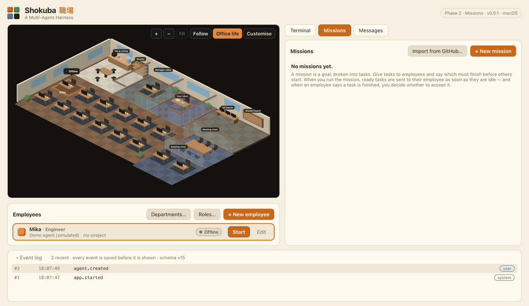
</p>
<p align="center"><sub>Making a mission from a GitHub issue (an animation, with a <b>stand-in</b> for the GitHub tool, so nothing here touches a real account). Shokuba reads GitHub through the <code>gh</code> tool you are already signed in with: it never sees a token or password, and it writes nothing to GitHub. What an issue says was written by other people, so it is shown as plain text and never followed.</sub></p>

<p align="center">
  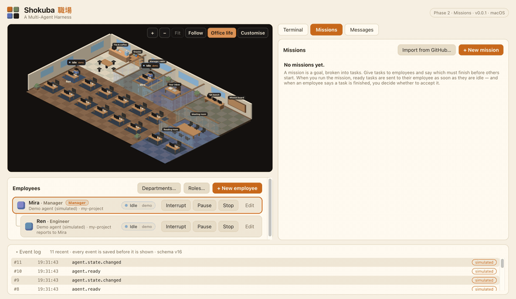
</p>
<p align="center"><sub>Planning from an issue (an animation, with <b>demo</b> agents and the stand-in GitHub tool). You hand the draft to a manager; they read the issue through a read-only tool that marks it as <b>untrusted</b>, and add tasks to that one draft. Nothing runs until you press <b>Run mission</b>, and nothing the issue says is ever typed into an agent's terminal. The demo manager plans two generic tasks: it does not understand the issue.</sub></p>

<p align="center">
  
</p>
<p align="center"><sub>Opening a pull request (an animation, with <b>demo</b> agents, a stand-in GitHub tool, and the push sent to a local folder, so nothing here touches a real account). Shokuba <b>shows exactly what it will do first</b> and does nothing until you press the button; if anything changed in between, it refuses and shows it again. It pushes only its own mission branch, through your own Git setup, never forcing, never merging, never commenting, and never publishes a change or text that holds a secret.</sub></p>

<p align="center">
  
</p>
<p align="center"><sub>A mission: <i>Design the API</i> was accepted, so <i>Build the API</i> and <i>Write the docs</i> were handed to two agents at once; <i>Review everything</i> waits for both. (Demo agents.)</sub></p>

<p align="center">
  
</p>
<p align="center"><sub>Two agents that answered each other endlessly. Shokuba counted the chain itself, held the seventh reply, and asked what to do. (Demo agents.)</sub></p>

<p align="center">
  
</p>
<p align="center"><sub>A team. <b>Mira</b> is the manager and talks to you. <b>Sora</b> and <b>Ren</b> report to Mira, so they ask Mira instead of messaging you, and Shokuba refuses if they try. (Demo agents.)</sub></p>

<p align="center">
  
</p>
<p align="center"><sub>A task's work, in its own Git branch: the files it changed and the diff, ready to read. Nothing reaches your project until <b>you</b> accept it, and even then it only joins the mission's branch. (Demo agent; the changes were written into its folder for this screenshot, as the demo agent does not edit files.)</sub></p>

<p align="center">
  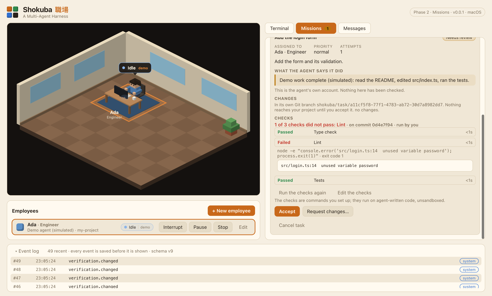
</p>
<p align="center"><sub>Checks you defined ran on the exact commit the agent submitted. Shokuba reports what each command did; whether the work is good is your call. (Demo agent, with demonstration commands.)</sub></p>

<p align="center">
  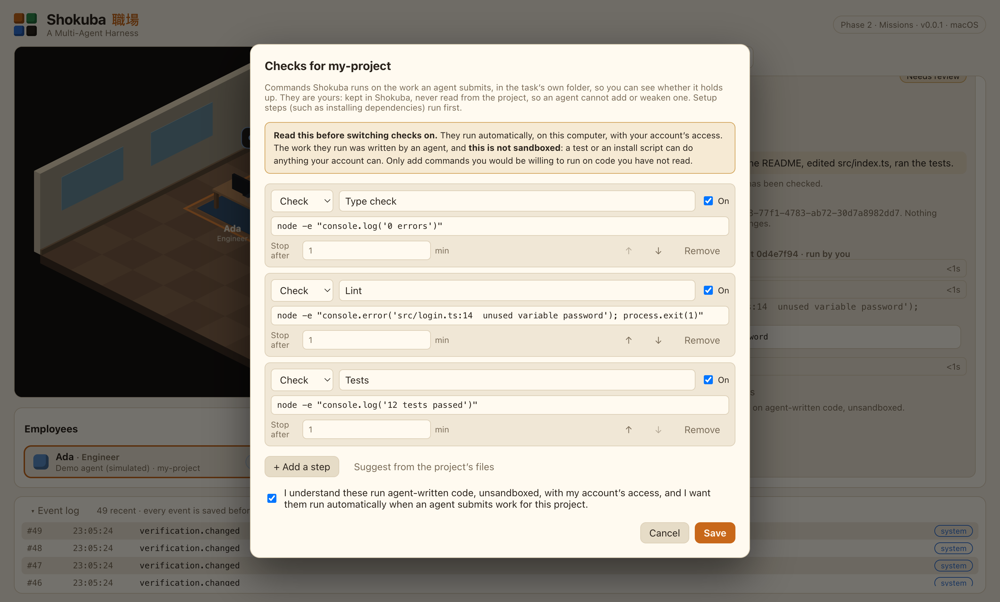
</p>
<p align="center"><sub>Setting checks up: they are yours, kept in Shokuba and never read from the project, and nothing runs until you have read and acknowledged what they do.</sub></p>

<p align="center">
  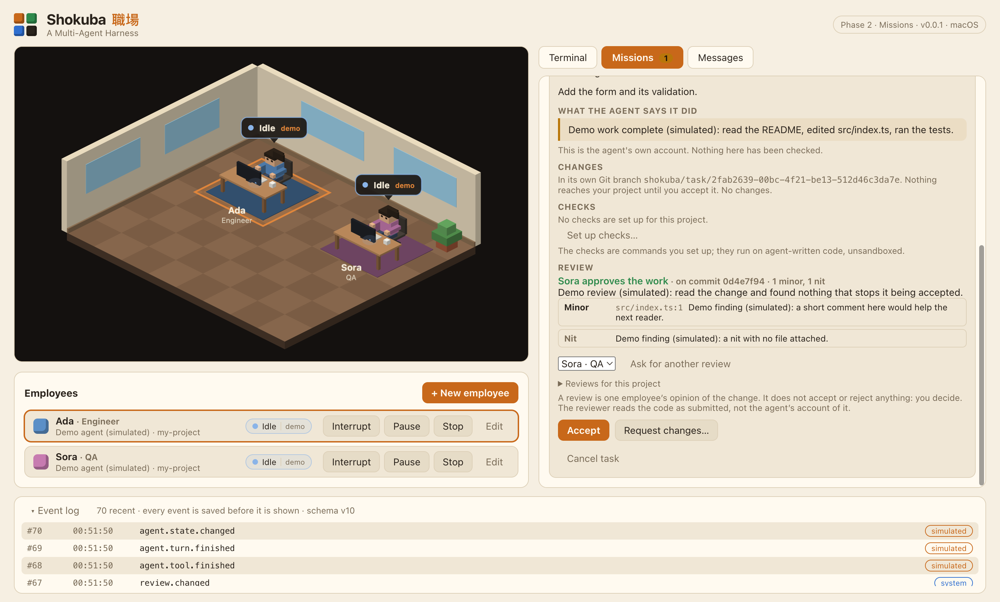
</p>
<p align="center"><sub>A different employee read the change, in a folder of their own, without seeing the author's account of it, and reported what they found. It is advice: <b>you</b> still accept. (Demo agents; the review text is scripted.)</sub></p>

**An evidence pack** turns all of that into one folder you can keep or share: what was asked, the agent's own account (labelled as a claim), the commits and the diff, every run of the checks, every review, who accepted the work and when. It is a record, not a proof, and it is not signed. [Read a sample report](docs/examples/evidence-report.md) (generated from demonstration data).

<p align="center">
  
</p>
<p align="center"><sub>The finish: an accepted task joins the mission's branch, its working folder is tidied away once its agent has left it, and the mission shows where the work is collecting and how to merge it yourself. (Demo agent.)</sub></p>

<p align="center">
  
</p>
<p align="center"><sub>The manager drafted this plan through Shokuba's planning tools. Nothing is sent to anyone until <b>you</b> read it and press <b>Run mission</b>. (Demo agents.)</sub></p>

<p align="center">
  
</p>
<p align="center"><sub>An agent that repeated one call eight times in a row. The circuit breaker refused the ninth, told the agent why, and now holds back its new tasks until you press <b>Reset</b>. (Demo agent.)</sub></p>

The office currently shows four desks and a single room. See the [roadmap](docs/ROADMAP.md) for the full plan.

## Why it's different

| Principle                                | What it means                                                                                                                  |
| ---------------------------------------- | ------------------------------------------------------------------------------------------------------------------------------ |
| **Evidence over claims**                 | A task carries files changed, commits, tests run, reviewer findings and known limitations. "Done" has to be shown.             |
| **Independent verification**             | The coder is never the only judge of its own work. A separate reviewer gets the diff and requirements — not the coder's story. |
| **A living office that tells the truth** | Avatars animate from real events, and every state records whether it was _reported_, _inferred_ or _simulated_.                |
| **Fully editable employees**             | Roles, skills, personalities, avatars, desks, departments — all yours to change.                                               |
| **Human stays in control**               | Configurable approval policies from strict to fully autonomous, plus a circuit breaker that limits and pauses runaway agents.  |

## How it works

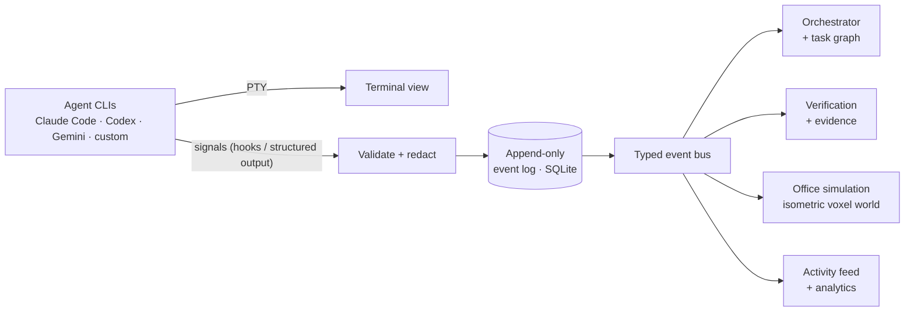

Events are **persisted before they are broadcast**, so the live office and a later replay always agree. The office never reads a terminal — it only reads events. Read more in [ARCHITECTURE.md](docs/ARCHITECTURE.md).

## Try it

**Requirements:** Node.js 22+, Git (2.40+ for task isolation). macOS is the supported platform today ([status of other platforms](docs/PLATFORMS.md)).

```bash
git clone https://github.com/prasodium/shokuba.git
cd shokuba
npm install
npm run dev          # launch the app
```

**Without an AI account:** click **Hire your first employee**, choose the **Demo agent (simulated)** provider, pick a folder, create them and press **Start**. Click into their terminal, type anything and press Enter — the demo agent "works" (reading, editing, running tests) and the office follows. Or open the **Missions** tab: create a mission, add tasks (say which must finish before others start), assign them, and press **Run mission**. Ready tasks are sent to their employee as soon as they report idle; when an agent says a task is finished you review its claim and accept it or send it back. The **Messages** tab shows what employees say to each other and to you, and lets you write to them. Press Ctrl+C mid-task to interrupt it. To build a team, hire an employee from the **Manager** role template, then hire others and choose **Reports to**: they can no longer message you directly and go through the manager. Point a demo employee at a Git repository and its tasks run in their own branch and folder. Open a submitted task and choose **Set up checks…** to have Shokuba run commands you choose (say `npm test`) on every submission; read the warning, because they run agent-written code, unsandboxed. Type `plan` into the manager's terminal and it drafts a mission for its team, which you review in **Missions** before running. To see the circuit breaker, type `loop` into a demo agent's terminal: it repeats one call until it is refused, and the office, roster and terminal show it as limited until you press **Reset**. Everything it does is labelled `simulated`. (On Windows the demo agent needs Node.js on your `PATH`.)

**With GitHub (optional):** to make missions from a project's issues, install the [GitHub CLI](https://cli.github.com) and run `gh auth login` once. Shokuba uses that login through `gh` and never sees a token. Then use **Import from GitHub…** in the Missions tab, for a project whose `origin` remote is on github.com.

**With Claude Code:** if `claude` is installed (on your `PATH`, or bundled in the VS Code / Cursor extension), it appears as a provider. Choose a working folder and start the employee. The first time, Claude Code may show its own one-time setup (theme, login) in the terminal panel — finish it there. Shokuba launches Claude Code with permission checks **on** and never offers a way to turn them off.

Verify your setup end to end — this builds the app and runs it inside real Electron, checking SQLite, a restart, a real pseudo-terminal, the whole agent pipeline (a demo agent reporting through the hook server into events, an interrupt, a clean stop), a two-agent mission (a task pasted into a real terminal, submitted over MCP, accepted by a person, releasing the dependent task), a runaway two-agent conversation stopped at the hop limit, a looping agent refused and then paused by the circuit breaker, a manager drafting a plan that goes nowhere until you run it, real Git worktrees and merges that leave your checkout untouched, a task run in its own branch (its agent restarted in the task's folder, its work committed, accepted into the mission's branch, and its folder removed once the agent has left), a real check failing on a first submission and passing on the resubmitted commit, a second agent reviewing the submitted work in a folder of its own and handing in its findings, the accepted task's evidence pack being saved without disturbing anything, and Git detection:

```bash
npm run smoke
```

```text
Electron 44.4.3 / Node 24.21.0 (ABI 149) on darwin-arm64
  PASS  sqlite-and-migrations
  PASS  history-survives-restart
  PASS  pty-spawn
  PASS  agent-pipeline
  PASS  mission-pipeline
  PASS  message-pipeline
  PASS  breaker-pipeline
  PASS  team-pipeline
  PASS  git-worktrees
  PASS  isolation-pipeline
  PASS  verification-pipeline
  PASS  review-pipeline
  PASS  locate-git
```

Run the full quality gate (typecheck, lint, tests):

```bash
npm run check
```

## Tech

Electron · TypeScript (strict) · React · Zustand · PixiJS (the office) · node-pty + xterm.js (terminals) · SQLite (better-sqlite3) · Zod · Vitest

The art direction is an **original** isometric-voxel look — blocky and warm, in the spirit of voxel worlds, but sharing no assets, textures, characters or code with any existing game.

## Contributing

Shokuba is early, so it's a great time to shape it. Read [CONTRIBUTING.md](CONTRIBUTING.md) — it covers setup, the architecture rules that keep the project honest, and where help is most wanted. Bug reports and ideas are welcome in [issues](https://github.com/prasodium/shokuba/issues).

If the idea of a living, honest AI office appeals to you, a ⭐ helps others find it.

## Security

See [SECURITY.md](SECURITY.md) for the security model, its limits, and how to report a vulnerability privately.

## License

[MIT](LICENSE) © 2026 prasodium
