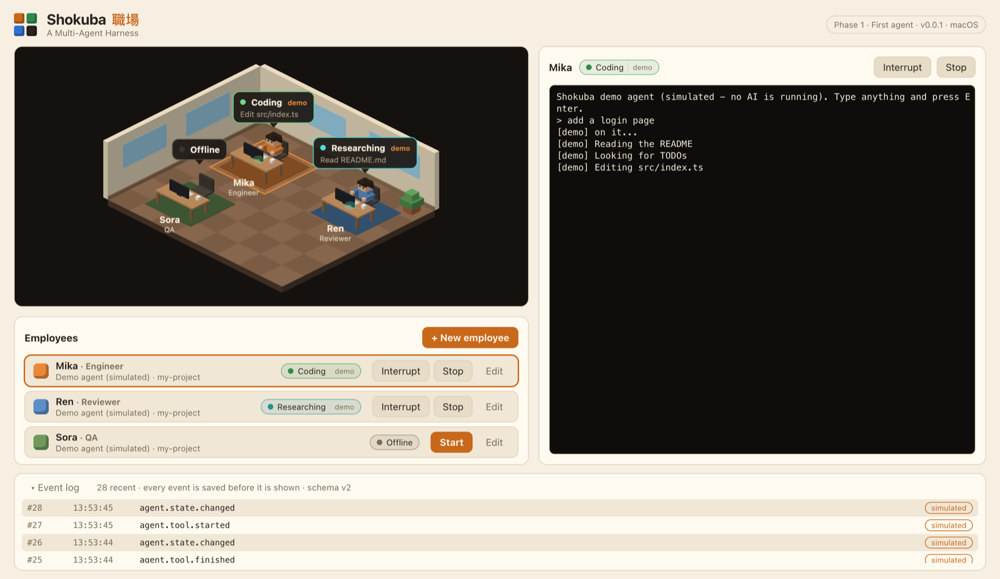
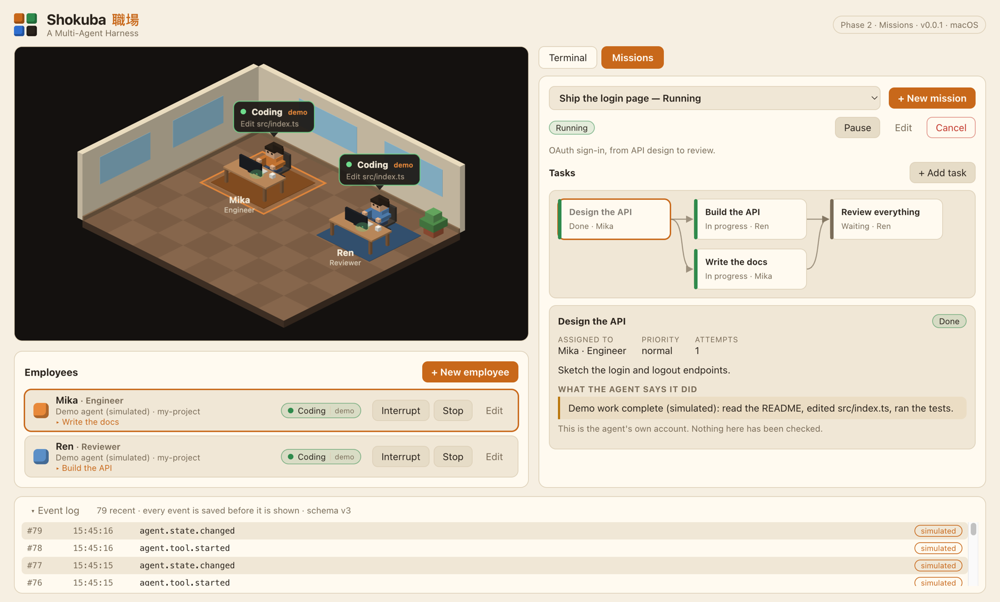
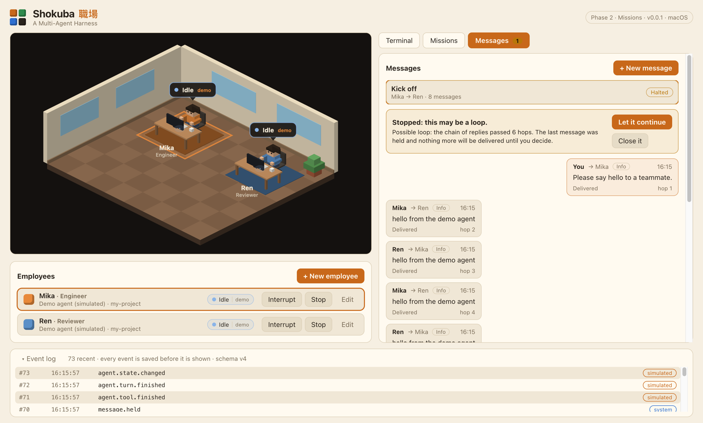
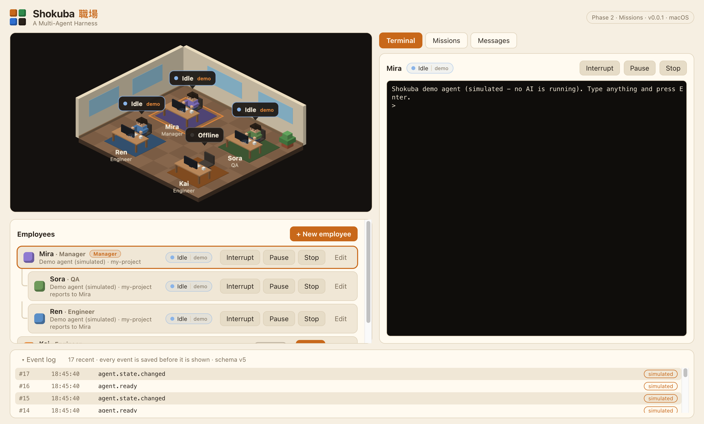
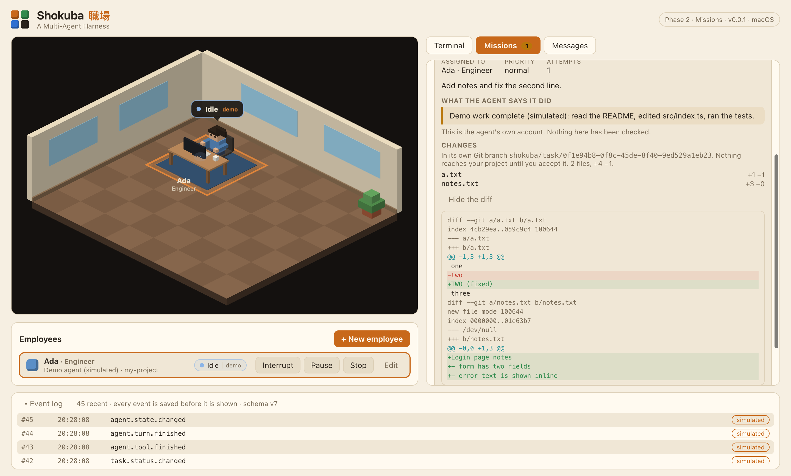
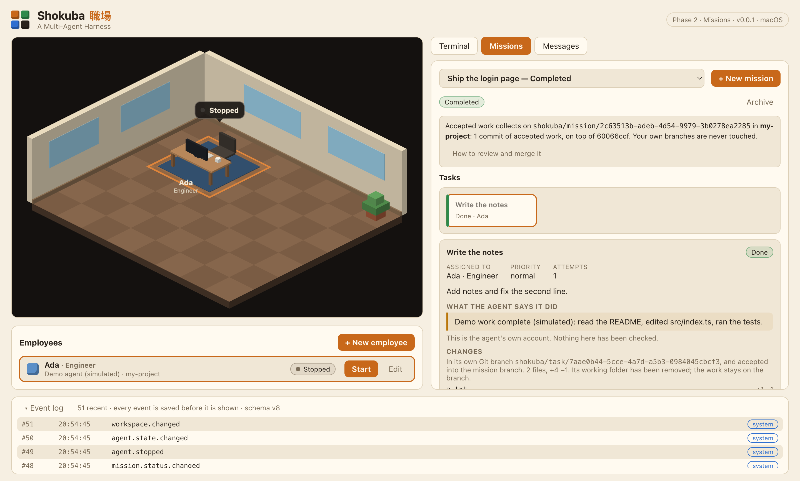
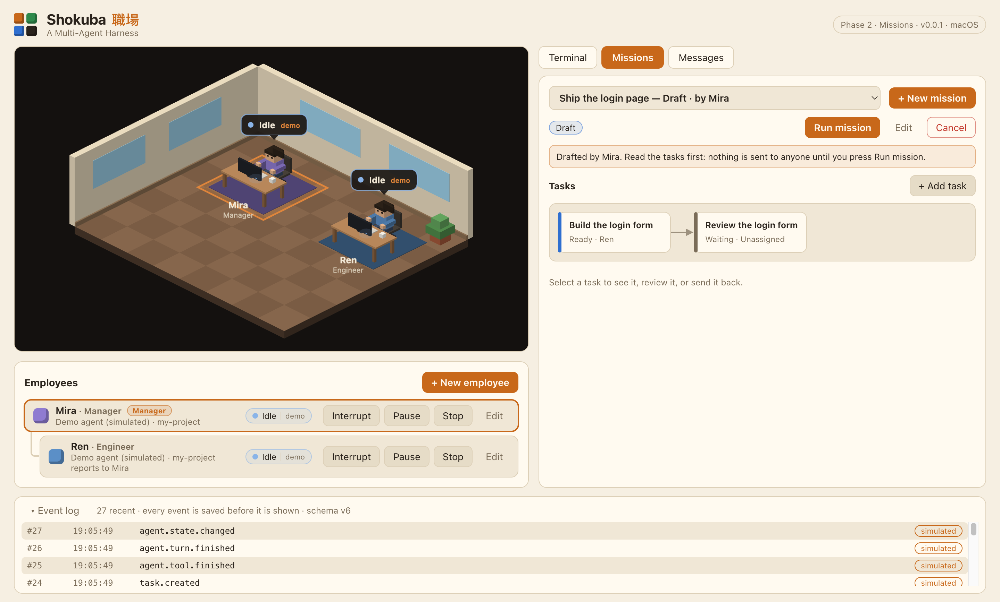
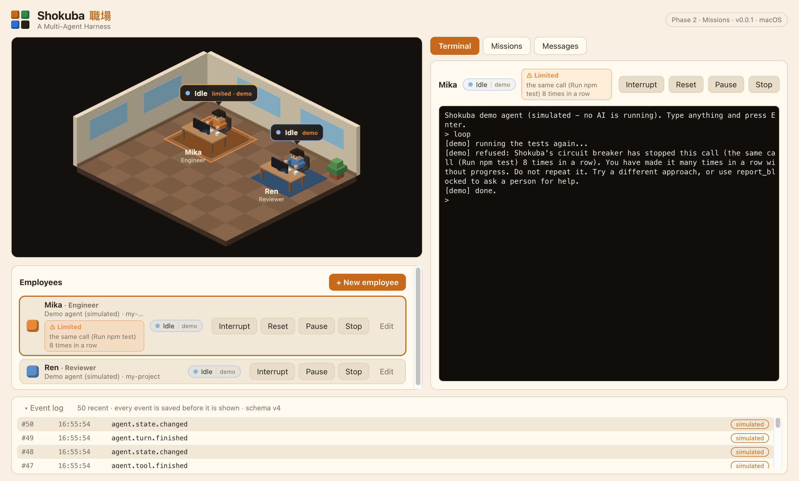
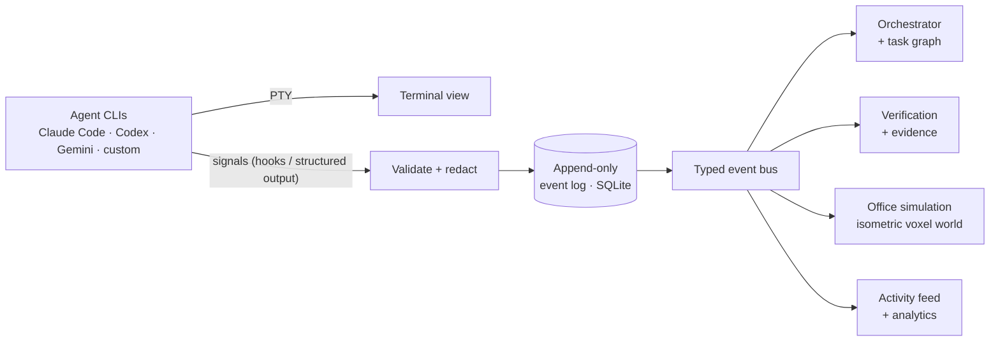

<p align="center">
  
</p>

<p align="center">
  <a href="https://github.com/prasodium/shokuba/actions/workflows/ci.yml"></a>
  <a href="LICENSE"></a>
  
  
  
</p>

<h3 align="center">Watch, control, and verify a living team of AI software engineers.</h3>

<p align="center">
  <b>Shokuba</b> (職場, <i>"workplace"</i>) is a local-first desktop app that runs real AI coding agents<br>
  as employees in a living isometric-voxel office — and makes them prove their work.
</p>

---

## What is this?

Most multi-agent tools are a wall of terminals. Shokuba is an **engineering control center** with a **living office on top**.

- Every AI agent is an **employee** with a role, a desk, skills and a real terminal.
- The office is **not decoration**. If an agent is running a test, its employee is at the QA station. If it hands work to a reviewer, it _walks over and hands it_. The office is a live view of real runtime state.
- Work isn't "done" because an agent said so. It's done when there's **evidence**: the diff, the test results, an **independent reviewer's** findings, and a verification report.
- **You stay the owner.** Approve, pause, redirect, reassign — or let it run, within the limits you set.
- **Local-first.** SQLite, Git and your own CLIs. No cloud backend required.

## Status: early development

Shokuba is being built in the open, in small, tested increments. Here is exactly where it stands — nothing below is marketing.

<p align="center">
  
</p>
<p align="center"><sub>Three <b>demo (simulated)</b> agents. Each bubble says what the event stream reports — and is marked <code>demo</code> here, because nothing in this screenshot is a real AI.</sub></p>

|                         |                                                                                                                                                                                                                                                                                                                                                                                                                                                                                                                                                                                                                                         |
| ----------------------- | --------------------------------------------------------------------------------------------------------------------------------------------------------------------------------------------------------------------------------------------------------------------------------------------------------------------------------------------------------------------------------------------------------------------------------------------------------------------------------------------------------------------------------------------------------------------------------------------------------------------------------------- |
| ✅ **Working today**    | Employees you can create, edit and start · a real terminal for each (xterm.js + PTY) · **Claude Code** launched in it · an isometric voxel office whose bubbles follow the event stream · a simulated demo agent (no AI account needed) · **missions with a task graph** · **messages between agents with loop protection** · **a circuit breaker for runaway agents** · **teams with a manager who talks to you and drafts missions for the team** · **each task in its own Git branch, with a diff to review, merged into a mission branch you merge yourself** · event log, redaction, hardened IPC · CI on macOS, Linux and Windows |
| 🔬 **Not yet verified** | Claude Code, _interactively_, reporting through its hooks and calling the mission tools. Both hook delivery and the MCP handshake are verified against the real Claude Code 2.1.276 in headless mode, and the real interface runs in the terminal, but the interactive end-to-end check is pending (see the [roadmap](docs/ROADMAP.md))                                                                                                                                                                                                                                                                                                 |
| 🚧 **Building next**    | Independent verification: a reviewer agent and an evidence pack for a task's work                                                                                                                                                                                                                                                                                                                                                                                                                                                                                                                                                       |
| 🗺️ **Planned**          | Codex / Gemini CLI / custom providers · GitHub issue → verified PR · the full office (rooms, walking, handoffs) · replay                                                                                                                                                                                                                                                                                                                                                                                                                                                                                                                |

<p align="center">
  
</p>
<p align="center"><sub>A mission: <i>Design the API</i> was accepted, so <i>Build the API</i> and <i>Write the docs</i> were handed to two agents at once; <i>Review everything</i> waits for both. (Demo agents.)</sub></p>

<p align="center">
  
</p>
<p align="center"><sub>Two agents that answered each other endlessly. Shokuba counted the chain itself, held the seventh reply, and asked what to do. (Demo agents.)</sub></p>

<p align="center">
  
</p>
<p align="center"><sub>A team. <b>Mira</b> is the manager and talks to you. <b>Sora</b> and <b>Ren</b> report to Mira, so they ask Mira instead of messaging you, and Shokuba refuses if they try. (Demo agents.)</sub></p>

<p align="center">
  
</p>
<p align="center"><sub>A task's work, in its own Git branch: the files it changed and the diff, ready to read. Nothing reaches your project until <b>you</b> accept it, and even then it only joins the mission's branch. (Demo agent; the changes were written into its folder for this screenshot, as the demo agent does not edit files.)</sub></p>

<p align="center">
  
</p>
<p align="center"><sub>The finish: an accepted task joins the mission's branch, its working folder is tidied away once its agent has left it, and the mission shows where the work is collecting and how to merge it yourself. (Demo agent.)</sub></p>

<p align="center">
  
</p>
<p align="center"><sub>The manager drafted this plan through Shokuba's planning tools. Nothing is sent to anyone until <b>you</b> read it and press <b>Run mission</b>. (Demo agents.)</sub></p>

<p align="center">
  
</p>
<p align="center"><sub>An agent that repeated one call eight times in a row. The circuit breaker refused the ninth, told the agent why, and now holds back its new tasks until you press <b>Reset</b>. (Demo agent.)</sub></p>

The office currently shows four desks and a single room. See the [roadmap](docs/ROADMAP.md) for the full plan.

## Why it's different

| Principle                                | What it means                                                                                                                  |
| ---------------------------------------- | ------------------------------------------------------------------------------------------------------------------------------ |
| **Evidence over claims**                 | A task carries files changed, commits, tests run, reviewer findings and known limitations. "Done" has to be shown.             |
| **Independent verification**             | The coder is never the only judge of its own work. A separate reviewer gets the diff and requirements — not the coder's story. |
| **A living office that tells the truth** | Avatars animate from real events, and every state records whether it was _reported_, _inferred_ or _simulated_.                |
| **Fully editable employees**             | Roles, skills, personalities, avatars, desks, departments — all yours to change.                                               |
| **Human stays in control**               | Configurable approval policies from strict to fully autonomous, plus a circuit breaker that limits and pauses runaway agents.  |

## How it works



Events are **persisted before they are broadcast**, so the live office and a later replay always agree. The office never reads a terminal — it only reads events. Read more in [ARCHITECTURE.md](docs/ARCHITECTURE.md).

## Try it

**Requirements:** Node.js 22+, Git (2.40+ for task isolation). macOS is the supported platform today ([status of other platforms](docs/PLATFORMS.md)).

```bash
git clone https://github.com/prasodium/shokuba.git
cd shokuba
npm install
npm run dev          # launch the app
```

**Without an AI account:** click **Hire your first employee**, choose the **Demo agent (simulated)** provider, pick a folder, create them and press **Start**. Click into their terminal, type anything and press Enter — the demo agent "works" (reading, editing, running tests) and the office follows. Or open the **Missions** tab: create a mission, add tasks (say which must finish before others start), assign them, and press **Run mission**. Ready tasks are sent to their employee as soon as they report idle; when an agent says a task is finished you review its claim and accept it or send it back. The **Messages** tab shows what employees say to each other and to you, and lets you write to them. Press Ctrl+C mid-task to interrupt it. To build a team, hire an employee from the **Manager** role template, then hire others and choose **Reports to**: they can no longer message you directly and go through the manager. Point a demo employee at a Git repository and its tasks run in their own branch and folder. Type `plan` into the manager's terminal and it drafts a mission for its team, which you review in **Missions** before running. To see the circuit breaker, type `loop` into a demo agent's terminal: it repeats one call until it is refused, and the office, roster and terminal show it as limited until you press **Reset**. Everything it does is labelled `simulated`. (On Windows the demo agent needs Node.js on your `PATH`.)

**With Claude Code:** if `claude` is installed (on your `PATH`, or bundled in the VS Code / Cursor extension), it appears as a provider. Choose a working folder and start the employee. The first time, Claude Code may show its own one-time setup (theme, login) in the terminal panel — finish it there. Shokuba launches Claude Code with permission checks **on** and never offers a way to turn them off.

Verify your setup end to end — this builds the app and runs it inside real Electron, checking SQLite, a restart, a real pseudo-terminal, the whole agent pipeline (a demo agent reporting through the hook server into events, an interrupt, a clean stop), a two-agent mission (a task pasted into a real terminal, submitted over MCP, accepted by a person, releasing the dependent task), a runaway two-agent conversation stopped at the hop limit, a looping agent refused and then paused by the circuit breaker, a manager drafting a plan that goes nowhere until you run it, real Git worktrees and merges that leave your checkout untouched, a task run in its own branch (its agent restarted in the task's folder, its work committed, accepted into the mission's branch, and its folder removed once the agent has left), and Git detection:

```bash
npm run smoke
```

```text
Electron 44.4.3 / Node 24.21.0 (ABI 149) on darwin-arm64
  PASS  sqlite-and-migrations
  PASS  history-survives-restart
  PASS  pty-spawn
  PASS  agent-pipeline
  PASS  mission-pipeline
  PASS  message-pipeline
  PASS  breaker-pipeline
  PASS  team-pipeline
  PASS  git-worktrees
  PASS  isolation-pipeline
  PASS  locate-git
```

Run the full quality gate (typecheck, lint, tests):

```bash
npm run check
```

## Tech

Electron · TypeScript (strict) · React · Zustand · PixiJS (the office) · node-pty + xterm.js (terminals) · SQLite (better-sqlite3) · Zod · Vitest

The art direction is an **original** isometric-voxel look — blocky and warm, in the spirit of voxel worlds, but sharing no assets, textures, characters or code with any existing game.

## Contributing

Shokuba is early, so it's a great time to shape it. Read [CONTRIBUTING.md](CONTRIBUTING.md) — it covers setup, the architecture rules that keep the project honest, and where help is most wanted. Bug reports and ideas are welcome in [issues](https://github.com/prasodium/shokuba/issues).

If the idea of a living, honest AI office appeals to you, a ⭐ helps others find it.

## Security

See [SECURITY.md](SECURITY.md) for the security model, its limits, and how to report a vulnerability privately.

## License

[MIT](LICENSE) © 2026 prasodium
