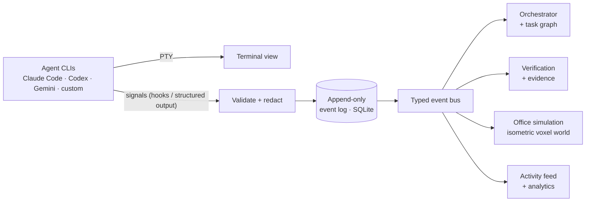

<p align="center">
  
</p>

<p align="center">
  <a href="https://github.com/prasodium/shokuba/actions/workflows/ci.yml"></a>
  <a href="LICENSE"></a>
  
  
  
</p>

<h3 align="center">Watch, control, and verify a living team of AI software engineers.</h3>

<p align="center">
  <b>Shokuba</b> (職場, <i>"workplace"</i>) is a local-first desktop app that runs real AI coding agents<br>
  as employees in a living isometric-voxel office — and makes them prove their work.
</p>

---

## What is this?

Most multi-agent tools are a wall of terminals. Shokuba is an **engineering control center** with a **living office on top**.

- Every AI agent is an **employee** with a role, a desk, skills and a real terminal.
- The office is **not decoration**. If an agent is running a test, its employee is at the QA station. If it hands work to a reviewer, it _walks over and hands it_. The office is a live view of real runtime state.
- Work isn't "done" because an agent said so. It's done when there's **evidence**: the diff, the test results, an **independent reviewer's** findings, and a verification report.
- **You stay the owner.** Approve, pause, redirect, reassign — or let it run, within the limits you set.
- **Local-first.** SQLite, Git and your own CLIs. No cloud backend required.

## Status: early development

Shokuba is being built in the open, in small, tested increments. Here is exactly where it stands — nothing below is marketing.

|                      |                                                                                                                                                                                              |
| -------------------- | -------------------------------------------------------------------------------------------------------------------------------------------------------------------------------------------- |
| ✅ **Working today** | Electron app shell · append-only event log (SQLite) · typed event bus · secret redaction · hardened, validated IPC · cross-platform layer · real-PTY smoke test running inside Electron      |
| 🚧 **Building next** | Claude Code as the first real agent · terminals (xterm.js) · the isometric office · agent state driven by real events                                                                        |
| 🗺️ **Planned**       | Multi-agent task graph · Git worktree isolation · independent verification & evidence packs · Codex / Gemini CLI / custom providers · GitHub issue → verified PR · replay · cinematic camera |

There are **no agents or office in the app yet**. See the [roadmap](docs/ROADMAP.md) for the full plan.

## Why it's different

| Principle                                | What it means                                                                                                                  |
| ---------------------------------------- | ------------------------------------------------------------------------------------------------------------------------------ |
| **Evidence over claims**                 | A task carries files changed, commits, tests run, reviewer findings and known limitations. "Done" has to be shown.             |
| **Independent verification**             | The coder is never the only judge of its own work. A separate reviewer gets the diff and requirements — not the coder's story. |
| **A living office that tells the truth** | Avatars animate from real events, and every state records whether it was _reported_, _inferred_ or _simulated_.                |
| **Fully editable employees**             | Roles, skills, personalities, avatars, desks, departments — all yours to change.                                               |
| **Human stays in control**               | Configurable approval policies from strict to fully autonomous, plus a circuit breaker against runaway loops and spend.        |

## How it works



Events are **persisted before they are broadcast**, so the live office and a later replay always agree. The office never reads a terminal — it only reads events. Read more in [ARCHITECTURE.md](docs/ARCHITECTURE.md).

## Try it

**Requirements:** Node.js 22+, Git. macOS is the supported platform today ([status of other platforms](docs/PLATFORMS.md)).

```bash
git clone https://github.com/prasodium/shokuba.git
cd shokuba
npm install
npm run dev          # launch the app
```

Verify your setup end to end — this builds the app and runs it inside real Electron, checking SQLite, a restart, a real pseudo-terminal and Git detection:

```bash
npm run smoke
```

```text
Electron 44.4.3 / Node 24.21.0 (ABI 149) on darwin-arm64
  PASS  sqlite-and-migrations
  PASS  history-survives-restart
  PASS  pty-spawn
  PASS  locate-git
```

Run the full quality gate (typecheck, lint, tests):

```bash
npm run check
```

## Tech

Electron · TypeScript (strict) · React · Zustand · PixiJS (office, upcoming) · node-pty + xterm.js (terminals, upcoming) · SQLite (better-sqlite3) · Zod · Vitest

The art direction is an **original** isometric-voxel look — blocky and warm, in the spirit of voxel worlds, but sharing no assets, textures, characters or code with any existing game.

## Contributing

Shokuba is early, so it's a great time to shape it. Read [CONTRIBUTING.md](CONTRIBUTING.md) — it covers setup, the architecture rules that keep the project honest, and where help is most wanted. Bug reports and ideas are welcome in [issues](https://github.com/prasodium/shokuba/issues).

If the idea of a living, honest AI office appeals to you, a ⭐ helps others find it.

## Security

See [SECURITY.md](SECURITY.md) for the security model, its limits, and how to report a vulnerability privately.

## License

[MIT](LICENSE) © 2026 prasodium
